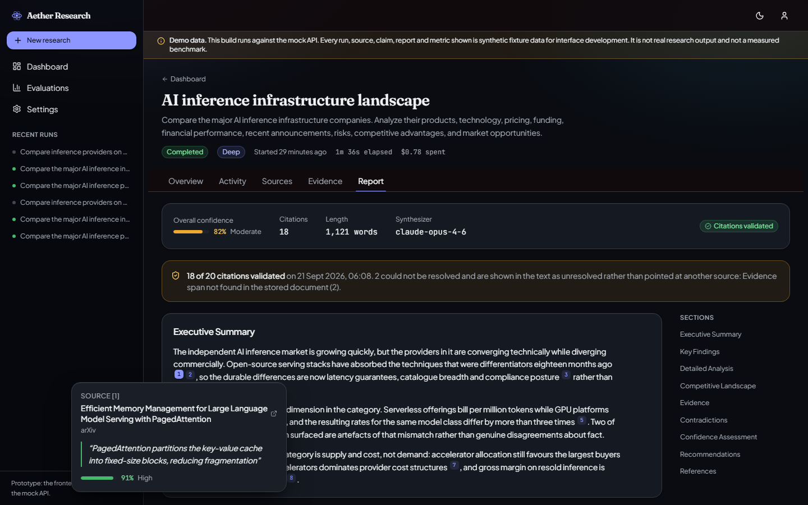
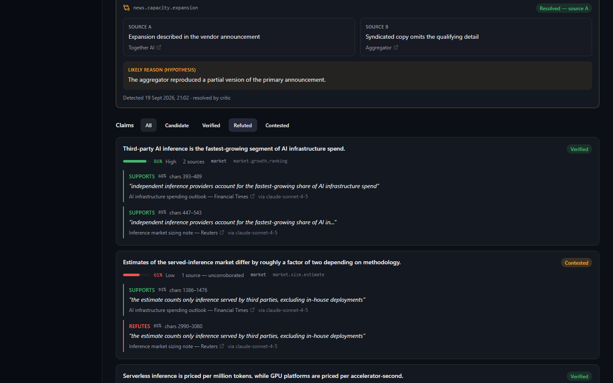
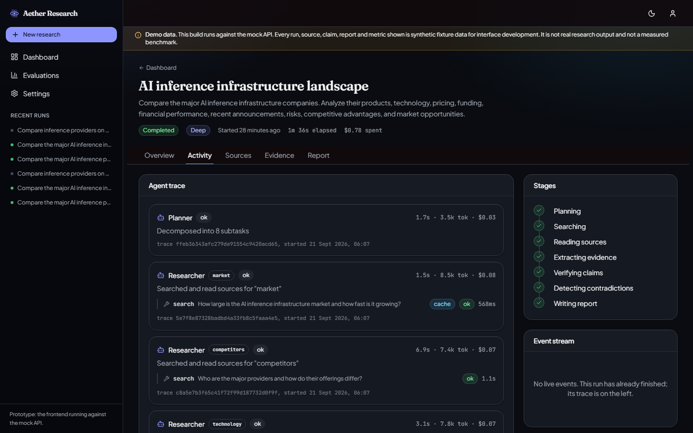
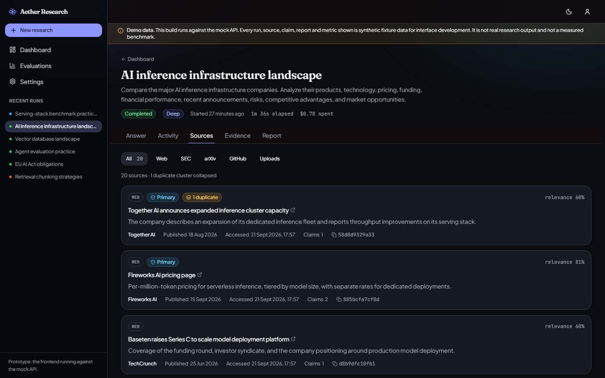
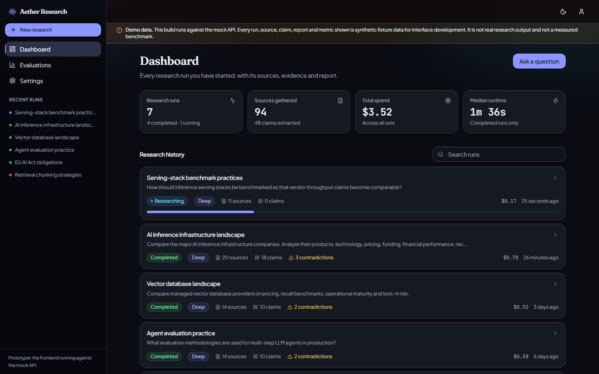
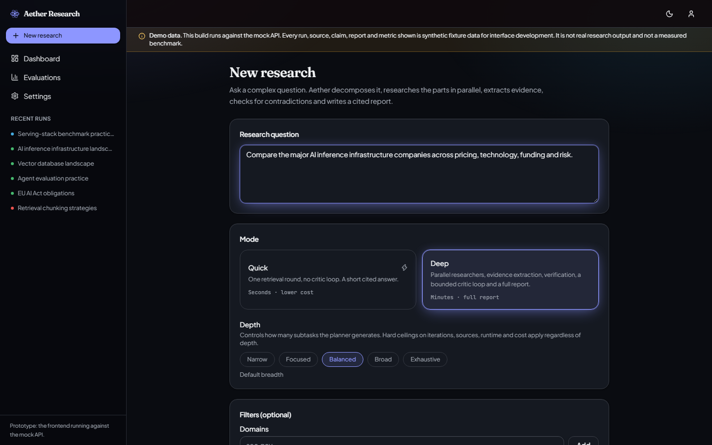
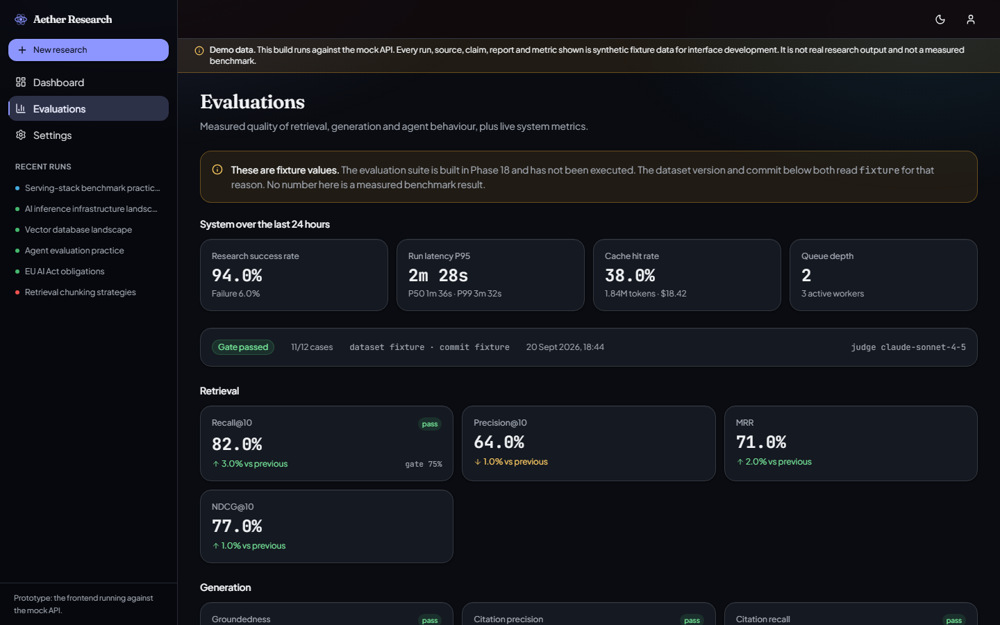

# AETHER RESEARCH

━━━━━━━━━━━━━━━━━━━━━━━━━━━━━━━━━━━━━━━━━━━━━━━━━━━━━━━━━━━━━━━━━━━━━━━━━━━━━━━━

> **© 2026 Msaketh7. All rights reserved.** This is proprietary software, not
> open source. You may read it here; you may not copy, redistribute, modify or
> reuse it without written permission. See [`LICENSE`](LICENSE).

**Autonomous Multi-Agent Research Platform**

Ask a complex research question. Aether decomposes it, researches multiple
sources in parallel, verifies evidence, detects contradictions, and generates a
citation-grounded report with full traceability.

This is **not** "a chatbot that searches Google." It is a long-running, stateful
research workflow with parallel agents, persistent state, source/evidence
management, evaluation, observability, caching, rate limiting, and deployment.

━━━━━━━━━━━━━━━━━━━━━━━━━━━━━━━━━━━━━━━━━━━━━━━━━━━━━━━━━━━━━━━━━━━━━━━━━━━━━━━━

## Contents

**Start here** · [What it does, in plain English](#plain-english-summary-read-this-first) · [An example](#example) · [Screenshots](#screenshots) · [Features](#features) · [Product modes](#product-modes)

**What it measures** · [Load testing and measured performance](#load-testing-and-measured-performance) · [Evaluation](#evaluation)

**How it is built** · [Architecture and the agent graph](#architecture) · [System topology](#system-topology) · [Tech stack](#tech-stack) · [Frontend](#frontend-architecture) · [Backend](#backend-architecture) · [Data model](#data-model) · [API](#api-architecture) · [Security](#security) · [Observability](#observability) · [Deployment](#deployment)

**Running it** · [Quick start](#quick-start) · [Production setup](#production-setup) · [Repository structure](#repository-structure)

**Where it stands** · [Current status](#current-status) · [Future improvements](#future-improvements) · [Build roadmap](#build-roadmap) · [Documentation](#documentation) · [Glossary](#glossary)

━━━━━━━━━━━━━━━━━━━━━━━━━━━━━━━━━━━━━━━━━━━━━━━━━━━━━━━━━━━━━━━━━━━━━━━━━━━━━━━━

## Plain-English summary (read this first)

**The problem.** Doing serious research (questions like "should we enter this
market?", "how do these competitors compare?", "what does the latest science
say?") means running dozens of searches, opening dozens of tabs, reading
everything, keeping track of which fact came from where, noticing when two
sources disagree, and finally writing it all up so someone else can trust it. It takes hours or days,
and the trail from "claim" back to "proof" usually gets lost.

**What Aether does.** You type one question. Aether acts like a **small team of
research analysts** that works for you:

| Role on a human research team                                                                              | The equivalent part of Aether     |
| ---------------------------------------------------------------------------------------------------------- | --------------------------------- |
| Lead analyst who breaks the big question into smaller ones and hands them out                              | **Planner**                       |
| Several junior analysts, each researching one sub-topic **at the same time**                               | **Researchers** (run in parallel) |
| Someone who highlights the exact sentence that proves each point and notes the source                      | **Evidence Extractor**            |
| A checker who confirms each fact appears in more than one trustworthy place                                | **Verification Agent**            |
| A checker who flags "these two sources disagree" instead of quietly picking one                            | **Contradiction Check**           |
| A demanding manager who asks "is this good enough?" and sends people back for more                         | **Critic**                        |
| The writer who turns all the findings into a clean, structured report                                      | **Synthesizer**                   |
| The fact-checker who makes sure every sentence in the report has a real source attached before it goes out | **Citation Validator**            |

**What you get back.** A structured report (executive summary, key findings,
detailed analysis, competitive landscape, risks, opportunities) in which
**every important statement has a clickable source and a confidence score**, and
where genuine disagreements between sources are shown rather than hidden.

**Why it is built the "hard" way.** Anyone can wire a search box to an AI model.
The engineering value here is everything around that: the work keeps running even
if a server restarts, it never spends more than a set budget of time and money,
it treats web pages as untrusted, it measures its own accuracy, and it can be
deployed and operated like a real product.

---

## Example

> **Question:** "Should our company invest in building an AI inference
> infrastructure business? Compare the market, competitors, technology, pricing,
> funding, recent developments, risks, and opportunities."

Aether turns that into seven parallel research streams (market, competitor,
technology, pricing, financial, recent news, risk), pulls from web search, SEC
EDGAR (official company filings), arXiv (research papers) and GitHub (open-source
activity), extracts every claim with a source and a confidence score, flags
contradictions instead of silently resolving them, and returns a structured
report where every material claim is cited.

---

## Screenshots

> These are the product running in **mock mode**, which is the only mode with a
> deterministic corpus - the same seven runs, the same claims, the same
> contradictions on every machine. The app's own banner appears in every shot
> and says so. Nothing here is real research output or a measured benchmark,
> and the screenshots are regenerated by `make screenshots` rather than taken by
> hand, so a stale one is a command away from being fixed rather than a chore
> nobody does.

**The report, and the thing it is all for.** Every `[n]` opens the source, the
verbatim quote behind it and the confidence attached to it. The banner above the
text is the citation validator's verdict - here 18 of 20 resolved, and the two
that did not are shown in the text as unresolved rather than quietly pointed at
some other source.



**Evidence: claims, their spans, and disagreements left standing.** Each claim
carries the verbatim sentences that support or refute it, with character offsets
into the stored document, the source, and the model that extracted it.
Contradictions are recorded as disagreements with a hypothesis about the cause -
never silently resolved into whichever number came first.



**The agent trace: why the run did what it did.** One row per node execution,
with the tool calls and model calls that hang from it - tokens, cost, latency,
cache hits and the trace id, so a question about a run is a query rather than a
log hunt.



**Sources, with their provenance.** Type, publisher, publication and access
timestamps, a content hash, how many claims each supports, and duplicate
clusters collapsed so corroboration counts distinct content rather than copies
of one press release.



<details>
<summary><b>The rest of the product</b> — dashboard, the request form, the evaluation page</summary>

**Dashboard.** Every run with its status, mode, findings, cost and runtime.



**Starting a run.** The question, the mode, and the bounds the run will be held
to.



**Evaluations.** The page that will render the benchmark once it has been run.
It is showing fixture values here and says so at the top: no evaluation has been
executed, and a page that rendered zeros would be claiming a result.



</details>

---

## Architecture

> **In plain terms:** the question enters at the top. The Planner splits it up.
> Several Researchers work at once (not one after another; that is what keeps
> it fast). Their findings are turned into "claims + proof", checked, and
> cross-examined for contradictions. A Critic decides whether the research is
> good enough; if not, it loops back for more, but no more than 4 times. When
> it is good enough, the Synthesizer writes the report and the Citation Validator
> refuses to let it through unless every citation points at real stored
> evidence.

```
                              START
                                │
                                ▼
                          Planner Agent                (splits the question)
                                │
                                ▼
                        Task Decomposition             (into checked sub-questions)
                                │
                 ┌──────────────┼──────────────┐
                 ▼              ▼               ▼
             Researcher 1   Researcher 2    Researcher 3     ← all at the same time
             ┌───┼───┐                          (parallel, not sequential)
             ▼   ▼   ▼
           Web  SEC arXiv/GitHub
                 │
                 └──────────────┼──────────────┘
                                ▼
                        Evidence Extractor            (claim + the sentence that proves it)
                                │
                                ▼
                       Claim Normalization            (tidy each claim into a standard shape)
                                │
                                ▼
                        Verification Agent            (is this backed by multiple sources?)
                                │
                                ▼
                       Contradiction Check            (do any sources disagree?)
                                │
                          ┌─────┴─────┐
                          ▼           ▼
                       Missing     Sufficient
                          │           │
                          ▼           ▼
                       Re-plan     Synthesizer        (write the report)
                          │           │
                          └───────────┘
                    (loop, max 4 times)
                                      │
                                      ▼
                             Citation Validator       (every claim must have a real source)
                                      │
                                      ▼
                                Final Report
                                      │
                                      ▼
                             Citations + Sources
```

---

## Features

Each feature below has a one-line plain explanation. **✓ means built and
exercised.** Two rows carry a different mark, because a tick on something that
has never run is the kind of claim this repository exists not to make.

- ✓ **Multi-agent research**: a team of specialised AI workers, not one model doing everything.
- ✓ **Agentic RAG**: the system looks things up in its own collected evidence before it writes, and decides what else to look up.
- ✓ **Web search**: finds pages on the open internet.
- ✓ **SEC EDGAR / arXiv / GitHub connectors**: pulls official company filings, scientific papers, and open-source project activity.
- ✓ **Document uploads**: your own PDFs and pages parsed in an isolated process and searched alongside the web.
- ✓ **Hybrid retrieval**: finds relevant text both by exact keywords and by meaning, then re-sorts by true relevance.
- ✓ **Evidence graph**: a linked record of every claim, the exact quote that supports it, and the source it came from.
- ✓ **Citation verification**: the report cannot be published until every citation points at real stored evidence.
- ✓ **Contradiction detection**: when sources disagree, both values are recorded with a likely reason; nothing is silently chosen.
- ✓ **Source deduplication**: three copies of one press release count as one source, so corroboration means something.
- ✓ **Durable execution**: the job saves its progress; a crash or restart resumes instead of starting over.
- ✓ **Streaming**: a live activity feed shows what the system is doing right now, and survives a reconnect hours later.
- ✓ **Model routing**: cheap fast models for simple steps, powerful models only for the hard reasoning; can also run fully local for comparison.
- ✓ **Cost governance**: a run's ceiling is enforced _before_ each call, and a run that hits it still writes its report, with a caveat saying why.
- ✓ **Caching**: searches, pages, extractions and embeddings by content hash, with simultaneous identical calls done once.
- ✓ **Authentication and rate limiting**: Argon2id, revocable per-device sessions, token buckets per identity, and an append-only audit log.
- ✓ **LLM observability**: every AI call is traced with its time, token count, cost, and result - and so is every tool call.
- ✓ **Load tested**: 370 research runs through the real pipeline, plus four Locust ladders over the HTTP surface. [Numbers and conditions.](docs/load-testing.md)
- **◐ Evaluation**: the scoreboard, the dataset and the release gate are **built**; no benchmark has been run, so every gate is ungated and every metric reads _not measured_.
- **◯ Production deployment**: two images, a compose stack, a Terraform root and five CI/CD pipelines are **written and checked on every change**; nothing is hosted, so the 99.5% uptime target is an aspiration rather than a measurement.

---

## Product modes

> **In plain terms:** sometimes you want a fast answer, sometimes a thorough
> report, and sometimes you want to keep digging into an answer you already got.

| Mode               | Target speed      | What it does                                                                                                        |
| ------------------ | ----------------- | ------------------------------------------------------------------------------------------------------------------- |
| **Quick**          | under ~30 seconds | Plan → search → rank → write a short cited answer                                                                   |
| **Deep**           | ~1-5 minutes      | The full pipeline above: parallel research, verification, contradiction checks, a critique loop, then a full report |
| **Conversational** | follow-ups        | "Go deeper on competitor X", reuses everything already gathered instead of starting over                            |

---

## Load testing and measured performance

> **In plain terms:** the system has been put under load and the numbers below
> came out of it. They were measured on a throttled laptop with the AI provider
> replaced by a stand-in that answers in half a second, so read them as
> **shapes** - which curve is flat, which one bends - rather than as the capacity
> of a deployment. The full account, including everything it does not tell you,
> is in [`docs/load-testing.md`](docs/load-testing.md).

**370 research runs** have been driven through the real pipeline: the real
queue, the real lease, the real LangGraph graph, all nine agents, the real
toolbelt behind its SSRF guard, ingestion, retrieval, the evidence projection
and report assembly. Only the model provider and the socket are scripted. Plus
four Locust ladders over the HTTP surface and a worker-concurrency sweep.

**The result that matters.** Execution latency does not move with load:

| Offered load | Queue wait P50 | **Execution P50** | **Execution P95** | Completed |
| ------------ | -------------- | ----------------- | ----------------- | --------- |
| 10 jobs      | 16.1 s         | **5.6 s**         | 15.4 s \*         | 10 / 10   |
| 25 jobs      | 19.1 s         | **6.0 s**         | 6.9 s             | 25 / 25   |
| 50 jobs      | 39.5 s         | **6.1 s**         | 7.3 s             | 50 / 50   |
| 100 jobs     | 79.9 s         | **6.2 s**         | **6.9 s**         | 100 / 100 |

\* the process's remaining cold start; in a ten-run profile one cold run _is_
the 90th percentile.

A run takes about six seconds at the median whether ten jobs are outstanding or
a hundred, and its P95 at a hundred is _lower_ than at ten. Everything that
grows is queue wait, and it grows linearly with the backlog. That is a system
**queueing rather than degrading**, which is the behaviour this architecture was
chosen for; a system that degraded instead would show execution latency climbing
as it filled up. Nothing was lost and nothing failed at any load.

**The HTTP surface, under Locust:**

| Users | Requests | Failures | `GET /research` P50 | `GET /health` P50 |
| ----- | -------- | -------- | ------------------- | ----------------- |
| 20    | 352      | 0        | 39 ms               | 8 ms              |
| 25    | 194      | 0        | 49 ms               | 10 ms             |
| 50    | 286      | 1        | 40 ms               | 9 ms              |
| 100   | 460      | 0        | 45 ms               | 9 ms              |

Five times the users, the same latency - and the request rate was bounded by the
generator's think time rather than by the server, so **this ladder did not find
the surface's ceiling.** It found that the ceiling is above 100 concurrent
readers on one process. The whole latency tail belongs to `POST /auth/register`,
which is Argon2id at the shipped parameters: the one endpoint in the product
designed to be slow. Strip it out and every remaining P95 is under 400 ms.

**Where a run's time goes**, read back out of the `agent_runs` rows the system
writes while doing its job rather than from a separate measurement path: the
researcher is 42% of node time and is the only node doing substantial work of
its own; six of the other seven cost the scripted provider's 0.5 s plus about
40 ms of bookkeeping; the citation validator calls no model at all and its 23 ms
says so. There is no hot spot - there is a pipeline that costs what it costs.

**What raising worker concurrency buys**, measured twice per point so the noise
is visible: 4 → 8 slots is +50% throughput; 8 → 16 is +4%, because at sixteen
the gateway's concurrency limit and the database pool's overflow both bind at
once. So the three settings are related, and the relationship is now measured
rather than guessed. The shipped default was **not** changed on the strength of
it - the deployment model is horizontal, and one throttled laptop is not the
evidence for a default.

**What none of this measures**, stated plainly because a load test's credibility
is mostly its disclaimers: a real model provider's throttling and tail latency;
Redis, which is not installed on the measuring machine; the dense retrieval arm,
which needs pgvector; and multi-worker behaviour, which the scenario suite
covers but the load test does not.

**Targets**, kept separate from measurements because they are goals for a
deployment that does not exist yet:

| Metric                      | Target        | Measured                           |
| --------------------------- | ------------- | ---------------------------------- |
| Deep research, P95 latency  | < 180 s       | 6.9 s execution, scripted provider |
| Quick research, P95 latency | < 30 s        | _not measured separately_          |
| Cost per run                | none declared | _not measured_ (no live run yet)   |
| Tool failure rate           | none declared | 0 across 370 runs, scripted socket |
| Availability (uptime)       | 99.5%         | _not measured_ (nothing deployed)  |

---

## Evaluation

> **In plain terms:** a research system that cannot measure its own
> groundedness is a text generator with a citation-shaped decoration. So there
> is a fixed set of test questions, a set of scorers, and a gate that can fail a
> release. The suite is **built**. It has **not been run**, and the table below
> says so rather than showing a zero.

| Metric                              | What it means                                    | Gate          | Measured       |
| ----------------------------------- | ------------------------------------------------ | ------------- | -------------- |
| Citation precision (structural)     | every `[n]` resolves to real stored evidence     | ungated       | _not measured_ |
| Citation recall                     | claims that need a citation and carry one        | ungated       | _not measured_ |
| Groundedness                        | report stays inside what was retrieved           | ungated       | _not measured_ |
| Claim correctness                   | claims that are factually right                  | needs a judge | _not measured_ |
| Planning quality / task completion  | subtasks covering the topic, and reaching `done` | ungated       | _not measured_ |
| Recall@K / Precision@K / MRR / NDCG | standard search-quality scores                   | ungated       | **measured**   |

**Every gate is ungated, deliberately.** A threshold written before a
measurement is an aspiration presented as a requirement, so each one is
configuration, is stored alongside the result it judged, and starts at whatever
the first real baseline supports.

**The one part that has been measured is retrieval** (Phase 8, lexical arm only

- this machine has no pgvector). The labelled questions, the method and the
  numbers are in [`data/eval/retrieval/`](data/eval/retrieval/). One convention
  there matters more than the formulae: a query with no labelled relevant chunk
  returns _nothing_, not zero, because averaging it in as zero would let an
  incompletely labelled dataset make every strategy look equally bad.

**Why the rest has not run.** Every case is a real research run against real
providers - a benchmark that exercised a special evaluation path would measure
that path - so a baseline needs credentials and spends money per case. The
harness is ready for the moment someone supplies both:

```bash
make evaluate                       # every case in data/eval/cases
make evaluate ARGS="--mode quick"   # a cheaper smoke run
```

The judged half (correctness, faithfulness) needs an LLM judge and is not
implemented; the structural half is, and a structural failure is a defect rather
than a model-quality signal. Method, dataset design and thresholds:
[`docs/evaluation.md`](docs/evaluation.md).

---

## System topology

> **In plain terms:** the user's browser talks to a "front counter" (the API).
> The front counter never makes you wait for the whole research job, it takes
> your request, hands you a ticket, and a separate "back room" worker does the
> long job. Postgres is the master filing cabinet, pgvector is the search-by-
> meaning index inside it, and S3 is the warehouse for bulky files like PDFs.
> Redis is the ticket queue and the bouncer that limits how much runs at once.

```
                              INTERNET
                                 │
                         ┌───────▼────────┐
                         │ Load Balancer  │   spreads traffic across servers
                         └───────┬────────┘
                                 │
                      ┌──────────▼──────────┐
                      │    Next.js App      │   the website you see
                      │      Frontend       │
                      └──────────┬──────────┘
                                 │  HTTPS / SSE (SSE = live progress feed)
                      ┌──────────▼──────────┐
                      │   API Gateway       │   the "front counter"
                      │     FastAPI         │
                      └──────────┬──────────┘
                                 │
                ┌────────────────┼────────────────┐
                ▼                ▼                ▼
           Auth Service     Research API      File API
          (log in / out)   (start/read runs) (uploaded PDFs)
                                 │
                           ┌─────▼─────┐
                           │  Redis    │   ticket queue + fast scratchpad + bouncer
                           └─────┬─────┘
                                 │
                          ┌──────▼──────┐
                          │ Task Worker │   the "back room" that does the long job
                          │  LangGraph  │
                          └──────┬──────┘
                                 │
              ┌──────────────────┼──────────────────┐
              ▼                  ▼                  ▼
          Planner           Researchers          Critic
                          ┌────┼────┐
                          ▼    ▼    ▼
                         Web  SEC  arXiv/GitHub
                                 │
                           Evidence Layer
                                 │
              ┌──────────────────┼──────────────────┐
              ▼                  ▼                  ▼
          PostgreSQL        Vector DB          Object Store
        (master filing    (search-by-meaning  (S3: PDFs, saved
         cabinet)          index)              web pages, reports)
                                 │
                          Synthesis Agent
                                 │
                          Citation Validator
                                 │
                             Report → PostgreSQL
```

---

## Tech stack

> **In plain terms:** the "Why" column says what job each tool does. A
> non-technical reader can read only that column. Everything named here is a
> dependency that is actually installed - there is no aspirational row.

| Layer            | Choice                                                        | Why (plain English)                                                                                     |
| ---------------- | ------------------------------------------------------------- | ------------------------------------------------------------------------------------------------------- |
| Frontend         | Next.js 16, React 19, TypeScript, Tailwind v4, TanStack Query | Builds the website, its styling, and the live progress feed                                             |
| API              | FastAPI (modular monolith)                                    | The "front counter" that receives requests; one well-organised codebase, not a scatter of tiny services |
| Orchestration    | **LangGraph**                                                 | Runs the multi-step agent workflow, remembers progress, handles the loop, resumes after a crash         |
| Chunking         | **LlamaIndex** (`llama-index-core`)                           | Splits a document into passages without losing where each one came from                                 |
| Model layer      | An in-repo `LLMGateway`                                       | One interface over Anthropic, OpenAI and Ollama, with routing, retry, failover and a call ledger        |
| System of record | PostgreSQL 17                                                 | The master database, the single source of truth                                                         |
| Vectors          | pgvector (inside Postgres)                                    | "Search by meaning" lives in the same database, one less moving part                                    |
| Object storage   | S3 / MinIO, behind an `ObjectStorage` interface               | Cheap warehouse for big files (PDFs, saved pages, reports)                                              |
| Cache / queue    | Redis, driven directly                                        | The ticket queue, the response cache, the rate limiter and the event fan-out                            |
| Auth             | Argon2id + server-side sessions in PostgreSQL                 | Sign-up and login owned rather than rented, and a session that can be revoked per device (ADR 0021)     |
| Observability    | OpenTelemetry, Prometheus, Grafana; LangSmith optional        | Tracing, metrics, dashboards, and AI-call inspection, so we can see what happened                       |
| Infra            | Docker, Terraform, AWS ECS Fargate, GitHub Actions            | Packaging, "infrastructure written as code", cloud hosting, and automated deploys                       |

**Two absences are deliberate.** There is no **LangChain**: the only thing this
system needed from it was a provider-neutral model interface, and `app/models`
is that in about 3,300 lines - three provider adapters and a gateway that also
prices every call, routes by role, retries, fails over and writes the ledger,
all of which would have had to be built on top of LangChain anyway. And there is no **Celery or ARQ**: the queue is a doorbell, not the
source of truth. A run's own database row is the worker's lease
([ADR 0017](docs/ADRs/0017-worker-lease.md)), so duplicate delivery,
cancellation and two workers offered the same job are settled by Postgres -
which is a property a task framework would have had to be prevented from
breaking rather than one it would have provided.

---

## Frontend architecture

> Built in Phase 1, before any backend existed. The point of building it first
> is that the product decisions - what a run looks like, what a citation has to
> prove, how a contradiction is presented - get made against a real interface
> rather than being inferred from a schema later.

**Stack.** Next.js App Router, TypeScript in strict mode (plus
`noUncheckedIndexedAccess`), Tailwind v4 with semantic design tokens,
shadcn/ui-style primitives kept in-repo, TanStack Query, native `EventSource`.

**Server state is TanStack Query, and only TanStack Query.** There is no global
store. The SSE hook writes into the same cache the REST hooks read, so the live
feed and the fetched snapshot cannot disagree.

**One transport, two targets.** Components never call `fetch`; everything goes
through a typed client whose base URL is chosen by `NEXT_PUBLIC_API_MODE`. In
`mock` mode that URL is a set of Next.js route handlers implementing the
contract from `docs/TDD.md` section 18 - including a real `text/event-stream`
endpoint with `id:` frames and `Last-Event-ID` replay. Both sides import the
same DTOs from `packages/shared-types`, so a contract drift is a compile error.

**The activity checklist is derived, never transmitted.** `deriveStages()` folds
the event stream into the seven-stage checklist. A separate "current stage"
event could contradict the trace; a derivation cannot.

**Report Markdown is parsed, never injected.** Report text is synthesised from
untrusted web pages, so it is turned into React elements by a small parser that
supports exactly what the synthesizer emits. `dangerouslySetInnerHTML` appears
nowhere in the codebase, and a test asserts that HTML in source-derived text
renders as literal text.

**Unresolvable citations are visible.** A `[n]` with no matching citation
renders as a warning marker rather than disappearing - a broken evidence chain
is exactly the thing a reader must not be protected from.

**Not measured is not zero.** Every formatter renders `null` as an em dash. A
run with zero sources and a run whose sources were never counted are different
facts, and the evaluation dashboard depends on the distinction.

**Key paths**

```
apps/web/src/
├── app/(app)/              # signed-in pages: dashboard, research/*, evaluations, settings
├── app/api/mock/v1/        # mock backend: REST + SSE route handlers (goes when live is the only mode)
├── components/ui/          # shadcn-style primitives
├── components/research/    # run header, stage checklist, event feed, source/claim/
│                           # contradiction cards, report renderer, citation popover
├── lib/api/                # typed client, endpoints, query keys, hooks
├── lib/research/           # stage derivation, event labels, Markdown parser, form schema
├── lib/sse/                # EventSource hook + query-cache reconciliation
└── mocks/                  # deterministic fixture corpus, dataset builder, event timeline
```

---

## Backend architecture

> Built in Phase 2, against the contract the frontend already consumed. The
> ordering matters: the API had to satisfy a client that already existed, so
> "the frontend will adapt" was never available as an escape hatch.

**Stack.** Python 3.12+, FastAPI, Pydantic v2, SQLAlchemy 2 (async), Alembic,
Redis, `uv` for locked dependencies. `ruff` and `mypy --strict` in CI.

**The API never runs a research workflow.** `POST /research` validates,
persists, publishes a started event and pushes a job. That boundary is an
explicit `JobQueue` interface rather than a function call, so it cannot later be
"optimised" into an inline await ([ADR 0001](docs/ADRs/0001-modular-monolith.md)).

**Authorisation was enforced before authentication existed.** Every research
object carries a `user_id`, every repository read is scoped by it, and a run
belonging to someone else returns the same `run_not_found` as one that never
existed - a 403 would confirm the id. Those rules were tested from the first
endpoint, so when Phase 20 put real sessions underneath them there was nothing
to retrofit.

**A session is a row; the cookie is a pointer to it.** Argon2id passwords, a
256-bit token stored as a SHA-256, and an `HttpOnly` cookie - so "sign this
device out" takes effect on that device's next request. Not a JWT, which either
cannot be revoked or is checked against a list on every request, at which point
it is a session with extra cryptography
([ADR 0021](docs/ADRs/0021-sessions-not-tokens.md)). Every request also draws on
a token bucket keyed by identity and route class, declared once on the whole
`/api/v1` router so a route added later is limited before anybody remembers to;
and every authentication event and research mutation lands in an append-only
audit log, written outside the request's transaction so a refused login still
leaves a record.

**One error envelope.** Every failure - validation, framework 404, dependency
outage, unhandled exception - leaves as `ApiErrorBody`, carrying the request id
so a user-reported `trace_id` can be found in the logs. Internals never reach
the client; a test asserts a connection string in an exception message does not
appear in the response.

**Persistence is an interface.** `ResearchRepository` is a protocol owned by
the domain; the SQLAlchemy implementation lives in `app/db/repositories`. When
Phase 3 replaced the in-memory adapter with Postgres, not one endpoint changed.

**The database enforces what the API also validates.** 23 tables with foreign
keys, check constraints bounding every enum and every 0-1 score, `citext` so an
email cannot be registered twice by changing its case, `ON DELETE CASCADE` so
deleting research leaves no orphans, and `ON DELETE RESTRICT` on citations so a
cited claim cannot be deleted out from under a report. Validation in the
application is the fast path; the schema is the backstop that also covers a
migration, a backfill or a hand-written `UPDATE`.

**Every query is bounded and scoped.** Each one carries a `LIMIT` or addresses a
single row by key, and `user_id` is in the `WHERE` clause rather than applied in
Python afterwards. Listing uses keyset pagination on `(created_at DESC, id
DESC)` - matching the index - so a client paging through history cannot skip or
repeat a row when two runs share a timestamp.

**A session is a transaction, scoped to one request.** It commits when the
handler returns and rolls back when it raises. The one deliberate exception is
documented on the repository interface: a run is committed _before_ its job is
dispatched, so a queue outage leaves a recoverable `queued` row rather than
discarding what the user asked for.

**Not-built-yet is distinguishable from empty.** An endpoint whose phase has not
landed returns `501 not_implemented`, not a plausible-looking empty `200`.

**A cross-language contract test** reads `packages/shared-types` and asserts the
Python enums match the TypeScript ones. Nothing in either compiler can see the
other, so this is the seam that keeps them honest.

**Key paths**

```
apps/api/app/
├── api/            routing, DI, error handlers, SSE relay
│   └── v1/         health, auth, research, files, settings, telemetry
├── core/           settings, logging, error taxonomy, enums, pagination
├── auth/           passwords, sessions, cookies, principal resolution
├── security/       rate limiting, client address, audit log
├── research/       run lifecycle, repository boundary, recorder, the event bus
├── db/             engine, session factory, ORM models, repositories, migrations
├── workers/        the queue, the run's lease, and the worker process itself
├── models/         the LLM gateway, its registry, routing and provider adapters
├── storage/        the ObjectStorage protocol, S3 and filesystem backends
├── sources/        the SSRF guard, the guarded client, the six research tools
├── retrieval/      ingestion (parse, chunk, embed) and hybrid retrieval
├── agents/         the research graph and the nine agents that fill it
├── evidence/       source dedup, and the claim/evidence/contradiction projection
├── reports/        report assembly and its projection
├── cache/          content-hash response cache, TTLs, single-flight
├── evaluations/    dataset, scorers, thresholds, runner
├── loadtest/       the load profiles and the measuring apparatus
└── observability/  the ledger, Prometheus instruments, OTel spans, middleware
```

---

## Data model

> **In plain terms:** this is the filing system. Its whole purpose is that you
> can start from any sentence in a report and walk backwards to the web page it
> came from - and that the database itself refuses to let that trail break.

**23 tables.** The chain the product exists to guarantee is one path through
them:

```
  users ──< research_runs ──< research_tasks        (who asked, and the plan)
                  │
                  ├──< sources ──< documents ──< document_chunks
                  │      url, publisher,   normalized    embedding (pgvector)
                  │      content_hash,     text in PG,   + tsvector (full-text)
                  │      credibility,      raw bytes
                  │      cluster_id        in S3
                  │
                  ├──< claims ──< evidence ────────────┘
                  │     normalized  verbatim span, char offsets,
                  │     statement,  stance (supports / refutes),
                  │     confidence  and the document it came from
                  │
                  ├──< contradictions     (two claims, two sources, a hypothesis)
                  │
                  ├──< reports ──< report_sections ──< citations
                  │                                       │
                  │                    ON DELETE RESTRICT to claims and sources
                  │
                  ├──< research_events    (the durable, numbered progress stream)
                  └──< agent_runs ──< tool_calls
                                   └──< llm_calls  (tokens, cost, latency, cache)
```

Plus `research_projects`, `uploads` and `research_run_uploads` (a user's files
and the runs they were attached to), `sessions` and `audit_log` (who was signed
in, and what they did), and `evaluations` and `feedback`.

**The schema is the backstop, not the decoration.** Foreign keys everywhere,
check constraints bounding every enum and every 0-1 score, `citext` so an email
cannot be registered twice by changing its case, `ON DELETE CASCADE` so deleting
research leaves no orphans - and, on citations, **`ON DELETE RESTRICT`**: a
cited claim or source cannot be deleted out from under a published report.
Validation in the application is the fast path; the schema is what also covers a
migration, a backfill or a hand-written `UPDATE`.

**A run's own row is the worker's lease.** `research_runs` carries the worker
id, the lease expiry and the dispatch clock, so a duplicate queue delivery, a
cancellation and two workers offered the same job are all settled by a
conditional `UPDATE` rather than by a distributed lock
([ADR 0017](docs/ADRs/0017-worker-lease.md)).

**The evidence tables are a projection, not a second truth.** The graph's
checkpoint is the run's state; `app/evidence/projection.py` writes it onto rows,
idempotently, keyed on derived ids - so replaying a resumed run cannot duplicate
a claim ([ADR 0016](docs/ADRs/0016-evidence-projection.md)).

**Migrations run on two branches.** `core` is the relational schema; `vector`
holds everything needing the pgvector extension, so a database without it can
still run everything else. `alembic upgrade heads` applies both.

---

## API architecture

> **In plain terms:** one versioned surface at `/api/v1`, a cookie for who you
> are, one shape for every error, and a rule that the front counter never does
> the long job itself.

| Method   | Path                          | What it does                                          |
| -------- | ----------------------------- | ----------------------------------------------------- |
| `POST`   | `/auth/register` `/login`     | Argon2id; both fail identically for an unknown email  |
| `POST`   | `/auth/logout`                | revokes this device's session server-side             |
| `GET`    | `/auth/me` `/auth/sessions`   | the caller, and their signed-in devices               |
| `DELETE` | `/auth/sessions/{id}`, `…`    | revoke one device, or all of them                     |
| `POST`   | `/research`                   | validates, persists, enqueues - **`202 Accepted`**    |
| `GET`    | `/research` `/research/stats` | keyset-paginated history, dashboard aggregates        |
| `GET`    | `/research/{id}`              | status, progress, counts, cost                        |
| `GET`    | `/research/{id}/plan`         | the planner's subtasks                                |
| `GET`    | `/research/{id}/sources`      | what was found, with dedup clusters and credibility   |
| `GET`    | `/research/{id}/evidence`     | claims, verbatim spans, contradictions                |
| `GET`    | `/research/{id}/activity`     | the agent trace with its tool and model calls         |
| `GET`    | `/research/{id}/report`       | the assembled report and the citation check's verdict |
| `GET`    | `/research/{id}/events`       | **SSE**, resumable with `Last-Event-ID`               |
| `POST`   | `/research/{id}/cancel`       | stops the run at the next node boundary               |
| `POST`   | `/research/{id}/followup`     | conversational mode: reuse what is already gathered   |
| `POST`   | `/files` · `GET` `/files/…`   | uploads, bounded and classified                       |
| `GET`    | `/settings` · `PATCH`         | user preferences                                      |
| `GET`    | `/evaluations`, `…/system`    | the benchmark surface, and live system metrics        |
| `GET`    | `/health` `/ready`            | liveness and readiness - **never routed publicly**    |
| `GET`    | `/metrics`                    | Prometheus exposition, unversioned, outside `/api/v1` |

**`POST /research` returns `202`, always.** It validates, writes the row,
publishes a `started` event and pushes a job id. The boundary is an explicit
`JobQueue` interface rather than a function call, so it cannot later be
"optimised" into an inline `await`
([ADR 0001](docs/ADRs/0001-modular-monolith.md)).

**One error envelope for everything.** Validation, a framework 404, a dependency
outage and an unhandled exception all leave as the same `ApiErrorBody` carrying
the request id, so a user-reported `trace_id` can be found in the logs.
Internals never reach the client - a test asserts that a connection string in an
exception message does not appear in the response.

**A 404 where a 403 would be the more literal answer.** A run belonging to
someone else returns the same `run_not_found` as one that never existed, because
a 403 confirms the id exists.

**Every list is bounded.** Keyset pagination on `(created_at DESC, id DESC)`,
matching the index, so a client paging through history cannot skip or repeat a
row when two runs share a timestamp.

**One commit boundary, one documented exception.** A session is a transaction
scoped to the request. The exception is written on the repository interface: a
run is committed _before_ its job is dispatched, so a queue outage leaves a
recoverable `queued` row rather than discarding what the user asked for.

**The frontend cannot drift from it.** A cross-language contract test reads
`packages/shared-types` and asserts the Python enums match the TypeScript ones.
Neither compiler can see the other, so this is the seam that keeps them honest.

---

## Security

> **In plain terms:** this system reads the open internet and then feeds what it
> read to an AI model. That is two dangerous things at once - a page can try to
> trick the model into obeying it, and a link can try to trick the server into
> fetching something it should not. Both are designed against rather than hoped
> about. Full analysis: [`docs/threat-model.md`](docs/threat-model.md).

**Retrieved content is a type, not a convention.** Everything fetched from the
open internet is wrapped in an `UntrustedContent` value that cannot be
interpolated into a prompt by accident - the sanitiser and the prompt structure
both take it as _data_ to be quoted, never as instructions to be followed. A
convention ("remember to sanitise this") survives exactly as long as the person
who remembers it; a type survives the next contributor
([ADR 0011](docs/ADRs/0011-untrusted-content-boundary.md)).

**The SSRF guard has four layers, and each exists because the one before it can
be defeated.** The attack is a search result pointing the fetcher at
`http://169.254.169.254/latest/meta-data/` so the worker retrieves its own cloud
credentials:

1. **Scheme, credentials and port.** `file://` and `gopher://` refused;
   `user:password@` URLs refused, because they leak into logs and referrers;
   ports belonging to protocols HTTP can be smuggled into, refused.
2. **DNS resolved before the request.** `localhost` is obvious;
   `evil.example.com` resolving to `127.0.0.1` is not, and neither is
   `http://2130706433/`. The _name_ is never trusted - the resolved addresses
   are.
3. **Every resolved address checked, not the first.** A hostile resolver can
   answer with one public address and one private one, and a client that
   validates `addresses[0]` will eventually connect to the other.
4. **The connected peer verified after connecting.** Between resolution and the
   TCP connection, DNS can change - classic rebinding. The real peer address is
   compared against the validated set and the fetch aborts before a byte of the
   body is read.

Redirects are followed **manually**, so every hop repeats all four. A client
with `follow_redirects=True` validates the first URL and then follows a `302`
anywhere, which is the most common way this control is bypassed in practice.

**Parsing happens in a child process that can be killed.** A PDF is a hostile
input format. The parser runs scrubbed and isolated, with a deadline, so a
malicious document costs a subprocess rather than the worker.

**A session is a row; the cookie is a pointer to it.** Argon2id passwords at the
shipped parameters (about 130 ms of deliberate CPU, run in a thread so the event
loop keeps serving), a 256-bit token stored as a SHA-256, and an `HttpOnly`
cookie - so "sign this device out" takes effect on that device's next request.
Not a JWT, which either cannot be revoked or is checked against a list on every
request, at which point it is a session with extra cryptography
([ADR 0021](docs/ADRs/0021-sessions-not-tokens.md)).

**Registering and signing in fail identically** for an unknown email and a wrong
password, including in how long they take - an endpoint that answers faster for
an address that does not exist is an account-enumeration oracle.

**Rate limiting is declared once, on the router.** Token buckets per identity
and route class - reads 120/min, writes 20/min, auth 10/min - attached to the
whole `/api/v1` router, so a route added next year is limited before anybody
remembers to do it. The client address is resolved through _declared_ proxy hops
only, because trusting `X-Forwarded-For` blindly lets a caller pick their own
rate-limit bucket.

**Authorisation predates authentication.** Every research object carries a
`user_id` and every repository read is scoped by it - rules that were tested
from the first endpoint, so when real sessions landed there was nothing to
retrofit.

**An append-only audit log**, written _outside_ the request's transaction, so a
refused login still leaves a record.

**No secret reaches the browser.** Provider keys live in the API process and are
read only through the typed settings layer. `gitleaks` runs over the working
tree and the whole history on every change, and a test walks every `SecretStr`
field and fails if one of them loads a value from the shipped `.env.example`.

---

## Observability

> **In plain terms:** when something takes too long or costs too much, you
> should be able to ask which step did it - and get an answer from a query,
> not from reading logs.

**Every node execution is a row.** `agent_runs` records the node, its status,
latency, tokens and cost; `tool_calls` and `llm_calls` hang from it. The current
span travels in a `ContextVar`, so a toolbelt shared by the whole process can
still say which step called it. That is what makes `GET /research/{id}/activity`
a real view rather than a summary, and it is also where the load test's
"where does a run's time go" table came from - a `GROUP BY` over rows the system
wrote while doing its job, not a separate measurement path
([ADR 0020](docs/ADRs/0020-the-ledger-and-the-gate.md)).

**The cost ceiling is enforced before each call, not between nodes.** A refusal
ends discovery, and the run still writes its report with a caveat saying why it
stopped. An unpriced model is refused outright under a budget. Spend is counted
from the ledger rather than from a second tally that could disagree with it.

**Prometheus on both processes**, OpenTelemetry spans at every seam, with
`trace_id` and `span_id` written onto the trace rows so a span in a collector
and a row in Postgres are the same event. The Grafana dashboard is a file in the
repository (`infra/monitoring/`), not a thing someone once clicked together.
LangSmith is off unless asked for.

**`/evaluations/system` is measured from rows**, and every field is nullable -
where `null` means _not measured_ and is rendered as an em dash rather than as a
zero. A run with no sources and a run whose sources were never counted are
different facts, and the product refuses to blur them.

---

## Deployment

> **In plain terms:** the whole system is described as code - two container
> images, a compose file that runs everything locally, and Terraform for AWS.
> **None of it has been applied.** There is no AWS account behind this
> repository, so the Terraform is validated rather than deployed, and this
> section describes what is written, not what is running.

**Two images, three process types.** `api.Dockerfile` serves the API, the worker
and the migration job - one image with different entrypoints, so they cannot
drift apart on models, migrations or configuration. `web.Dockerfile` is the Next
standalone build. Both build from the repository root.

**A compose stack that runs the real thing.** `make up` brings up Postgres with
pgvector, Redis, MinIO, Prometheus and Grafana; `make up-app` adds the API, the
worker and the web app under the `app` profile, so the whole system runs in
containers on one machine.

**Terraform for ECS Fargate**, as a modular root:
`modules/{network,security,database,cache,storage,alb,ecs-cluster,ecs-service,secrets}`
with one `.tfvars` per environment. `terraform validate` accepts it.
Kubernetes manifests exist as the portability escape hatch
([ADR 0008](docs/ADRs/0008-aws-ecs-deployment.md)).

**Five CI/CD workflows, split by what they cost** rather than by what they
cover:

| Workflow     | Runs on         | Does                                                        |
| ------------ | --------------- | ----------------------------------------------------------- |
| `ci.yml`     | every PR        | lint, types, secret scan, dependency scan, infra checks     |
| `test.yml`   | every PR        | the suites, with real Postgres and Redis service containers |
| `build.yml`  | main            | both images: built, run, scanned, **then** pushed by digest |
| `eval.yml`   | guarded, manual | the benchmark - needs credentials and spends money          |
| `deploy.yml` | guarded         | build, migrate, roll, smoke-test, roll back                 |

A pull request requires one check, `ci`, which waits for every other job.
That aggregate exists because a branch protection rule names one check: without
it, a job added later is optional until somebody remembers to update the rule.

**Four properties of the deploy pipeline are decisions, not defaults**, and each
is asserted by a test rather than left to review. Images are **scanned before
they are pushed**, because a vulnerable image already in a registry is one
somebody can deploy. Deployment is **by digest**, because a tag can be moved
after a deployment decided to trust it. The rollback target is **recorded before
anything changes**. And the **migration runs after the new task definition is
registered and before the services roll** - written that way because `ecs
run-task` can override a container's _command_ but not its _image_, so the
obvious version would have run the previous build's Alembic against the new
build's schema.

**The schema is deliberately not rolled back.** `alembic downgrade` against a
database that has taken writes under the new schema can lose them, so a failed
deployment rolls the _code_ back and leaves the schema forward. What makes that
safe is a discipline rather than a mechanism: every migration must leave the
previous release able to run - expand in one release, contract in a later one.

**The smoke test is stdlib-only**, because a post-deploy check that installs a
dependency tree first can fail for reasons that have nothing to do with the
deployment. It asks five questions from outside: does the frontend render, is
the API reachable at the same origin, is it _this_ application, does the
versioned surface refuse an unauthenticated caller, and are the probes still not
routed publicly.

---

## Repository structure

```
aether-research/
├── apps/
│   ├── web/                 # Next.js frontend (the website)
│   │   ├── src/app/         # pages, plus the mock backend that makes fixtures real
│   │   ├── src/mocks/       # the deterministic fixture corpus
│   │   └── e2e/             # Playwright journeys
│   └── api/                 # FastAPI + worker (front counter + back room)
│       ├── app/             # 18 modules - see "Backend architecture" above
│       ├── migrations/      # Alembic, two branches: core and vector
│       └── tests/           # pytest, incl. tests/scenarios/ (the fifteen)
├── packages/
│   ├── shared-types/        # shared data definitions used by both website and server
│   ├── prompts/             # a pointer: the templates ship inside the API package
│   └── evaluation/          # the scoring harness
├── data/
│   ├── eval/                # the benchmark dataset, and the retrieval baseline
│   ├── loadtest/            # the measured load-test results
│   └── seed/  fixtures/
├── infra/
│   ├── docker/              # api.Dockerfile (api + worker + migrate), web.Dockerfile
│   ├── terraform/           # the AWS root: 9 modules, one .tfvars per environment
│   ├── kubernetes/          # the portability escape hatch (ADR 0008)
│   └── monitoring/          # Prometheus scrape config, the Grafana dashboard
├── docs/
│   ├── PHASES.md            # the 25-phase build plan and what each one landed
│   ├── PRD.md  TDD.md  architecture.md  threat-model.md  evaluation.md
│   ├── load-testing.md      # the measured numbers and their conditions
│   ├── screenshots/         # generated by `make screenshots`
│   └── ADRs/                # 21 short records of "why we chose X"
├── scripts/                 # smoke.py (post-deploy), screenshots.mjs, loadtest.py
├── .github/workflows/       # ci, test, build, eval, deploy
├── docker-compose.yml
├── Makefile
└── README.md
```

---

## Current status

**All 25 phases are complete** ([build plan](docs/PHASES.md)). The frontend
is a working product; it talks to a real FastAPI backend that persists to
PostgreSQL; and behind it are object storage, a provider-neutral model gateway,
six research tools behind an SSRF guard, a document ingestion pipeline, hybrid
retrieval, the research graph - bounded, cancellable and checkpointed - and the
nine agents that run inside it, from planning a question to writing a report
whose every citation has been checked back to a source that was really
retrieved.
Switching the frontend between fixtures and the live API is one environment
variable, with no code change
([ADR 0009](docs/ADRs/0009-frontend-mock-transport.md)).

| Phase | Scope                                                                                                              | Status |
| ----- | ------------------------------------------------------------------------------------------------------------------ | ------ |
| 0     | Monorepo, tooling, local stack, ADRs, architecture/threat-model/evaluation docs                                    | Done   |
| 1     | Frontend product prototype against a mock API, unit + end-to-end tests                                             | Done   |
| 2     | Backend foundation: FastAPI, typed settings, error contract, authorisation, health probes, research API, SSE       | Done   |
| 3     | Data layer: PostgreSQL schema, Alembic migrations, pgvector, repositories, pooling                                 | Done   |
| 4     | Object storage: S3-compatible abstraction, MinIO locally, a filesystem backend for tests                           | Done   |
| 5     | Model gateway: Anthropic, OpenAI and Ollama behind one interface, with routing, retry, failover and a call ledger  | Done   |
| 6     | Research tools: search, fetch, parse, SEC, arXiv and GitHub behind an SSRF guard and an untrusted-content type     | Done   |
| 7     | Document ingestion: uploads, isolated parsing, offset-exact chunking, embeddings, metadata filtering               | Done   |
| 8     | Hybrid retrieval: vector and lexical search, rank fusion, reranking, a retrieval benchmark                         | Done   |
| 9     | LangGraph agent system: typed research state, the graph, bounded loops                                             | Done   |
| 10    | Agents: planning, research, evidence, verification, critique, synthesis, citation validation                       | Done   |
| 11    | Evidence system: the claim, evidence and contradiction chain persisted, source deduplication, credibility          | Done   |
| 12    | Report generation: the structured report, citations by source, a validator that proves each one                    | Done   |
| 13    | Background workers: the queue, the worker process, resumable runs that survive a restart                           | Done   |
| 14    | Streaming: progress events from the worker, over a bus that works with more than one API process                   | Done   |
| 15    | Caching: searches, pages, extractions and embeddings by content hash, with simultaneous identical calls done once  | Done   |
| 16    | Cost and token governance: the call ledger written, a run's ceiling enforced before the money is spent             | Done   |
| 17    | Observability: Prometheus metrics, OpenTelemetry spans, a Grafana dashboard, a measured system panel               | Done   |
| 18    | Evaluation: a versioned dataset, structural scorers, configurable gates, `make evaluate`                           | Done   |
| 19    | Testing: the fifteen end-to-end research scenarios, each driven through the whole vertical slice                   | Done   |
| 20    | Security: authentication, per-identity rate limiting, an audit log, dependency scanning                            | Done   |
| 21    | Load testing: 10/25/50/100 concurrent research jobs and a Locust ladder over the API, with measured numbers        | Done   |
| 22    | Optimisation: profiled, one measured defect fixed with before/after, the worker-concurrency curve measured         | Done   |
| 23    | Infrastructure: two container images, the full compose stack, a modular Terraform root, Kubernetes manifests       | Done   |
| 24    | CI/CD: five workflows - gates, tests, images, the benchmark, and a deployment that migrates, proves and rolls back | Done   |
| 25    | Documentation: screenshots, and a pass over every document now that the system is complete                         | Done   |

In **mock mode** the whole product is explorable: browse research history, start
a run, watch the agent timeline stream over SSE, inspect sources and duplicate
clusters, read claims with their verbatim evidence spans, see contradictions
recorded rather than resolved, and open a report where every `[n]` resolves to a
source and the quote behind it. Every figure there is synthetic fixture data,
and the app says so in a banner on every page.

In **live mode** the same UI runs against the real stack: runs are validated,
authorised, written to Postgres and queued, `POST /research` returns `202`, the
SSE stream is real, and a run survives a restart of the API process.

**A queued run is now executed.** A separate worker process takes it off the
queue, ingests the documents it was created with, runs the research graph, and
writes its claims, evidence, contradictions and report. The run's own row is the
worker's lease, so a duplicate delivery, a cancellation and a second worker
offered the same job are all settled by the database; a run whose worker is
killed or deployed over is resumed at the node that had not finished rather than
started again.

**And it narrates what it is doing.** Every superstep of the graph becomes
progress events - the plan, each subtask and query, each source read, each claim
extracted, each contradiction found, the critic asking for another round, the
report - carried over Redis to whichever API process is holding the stream. Each
one is numbered by being stored, so a browser that reconnects with
`Last-Event-ID` resumes exactly where it stopped, hours later or against a
different replica. A worker that takes over a paused run continues the stream
rather than repeating it.

**Work is not paid for twice.** A search, a fetched page, the article extracted
from it and a text's embedding are cached by content hash, and identical calls
still in flight are done once rather than several times - which is the normal
case when parallel researchers are given overlapping subtasks. Nothing that
belongs to one person is cached: there is no namespace to put it in. A cache hit
is recorded as a call that cost nothing, rather than as no call at all.

**And it can be watched and measured.** Every node execution is a row with
the tool and model calls it made hanging from it, so "which step spent the
money" is a query; a run's cost ceiling is enforced before each call rather
than noticed after one, and a run that hits it still writes its report with a
caveat saying why. Both processes export Prometheus metrics, every seam opens
an OpenTelemetry span, and the Grafana dashboard is a file in the repository.

Capabilities whose phase has not landed return `501 not_implemented`, so
"not built yet" is always distinguishable from "no results".

The evaluation suite is built: a versioned dataset in `data/eval/cases`,
structural scorers, gates that are configuration and are stored with each
result, and `make evaluate`. **It has not been run.** Every case is a real
research run against real providers, so a baseline costs money, and this
repository publishes no number it did not measure - the page and the API both
report "not measured" rather than a zero. The one benchmark executed so far is
the retrieval benchmark (Phase 8, lexical arm only).

---

## Quick start

Requires Node 22+, Python 3.12+, [uv](https://docs.astral.sh/uv/) and a
PostgreSQL you can create a database in. **Docker is not required.**

```bash
git clone <repo-url> "aether-research" && cd aether-research
cp .env.example .env

npm ci                        # --legacy-peer-deps only for a cold resolve
cd apps/api && uv sync && cd -   # the API virtualenv, from the lockfile

npm run app                   # everything
```

`npm run app` is the whole system in one command: it migrates the database,
starts the API on `:8000`, starts a worker, and serves the frontend on `:3000`
**pointed at that API** rather than at its fixtures. One Ctrl-C stops all three,
children included.

Three spellings of the same thing, so it works whatever you have installed:

```bash
npm run app                   # needs only npm, which you already have
make start                    # if you use make
python scripts/dev.py         # no toolchain at all
```

It adapts to what you have installed rather than demanding it, and says what
each choice costs:

| Missing               | What happens instead                                                                                                                                                                                                                          |
| --------------------- | --------------------------------------------------------------------------------------------------------------------------------------------------------------------------------------------------------------------------------------------- |
| **Redis**             | The API and worker cannot share a queue, so the worker's reconciliation sweep picks queued runs out of Postgres. A real mechanism, not a stub - it just costs a few seconds before a run starts.                                              |
| **pgvector**          | Only the relational migration branch is applied and retrieval runs its lexical arm. Chunks are stored with vectors pending, which is a declared state rather than an error.                                                                   |
| **A usable database** | It creates one - `initdb` under `.data/postgres`, trust auth, port 55432, data persisted between runs. No superuser password, because it is our cluster. A `DATABASE_URL` you set yourself is always used as-is; only the default falls back. |

```bash
npm run app:api               # the same, without the frontend
npm run dev                   # only the frontend, on fixtures - no backend needed
python scripts/dev.py --own-db   # force the managed database, ignoring any other
```

`make dev` is still the fastest way to look at the product: it needs no
database, no Python and no keys, and every figure in it is synthetic fixture
data that the app labels as such on every page.

### Verifying it

```bash
make ci          # frontend + backend: format, lint, typecheck, unit tests
make test-e2e    # Playwright smoke suite (builds and serves the app)
```

The unit suite covers the pure logic that the UI depends on - event-to-stage
derivation, the report Markdown parser, form validation, the HTTP error
contract, and the self-consistency of the fixtures (every citation must resolve
to a claim, an evidence span and a source). The end-to-end suite drives the real
browser through the whole journey, including a live `text/event-stream`.

### Running the backend

Requires Python 3.12+ and [uv](https://docs.astral.sh/uv/).

```bash
make up            # Postgres + pgvector, Redis, MinIO, Prometheus, Grafana
make api-install   # create apps/api/.venv from the lockfile
make migrate       # apply both migration branches
make api           # uvicorn on :8000, OpenAPI UI at /docs
make worker        # in a second terminal: the process that runs the research
```

Two processes, one codebase. The API never runs a research workflow; the worker
never serves a request. Stopping a worker mid-run is safe - it hands the run back
and the next one resumes it - and running several of them is how the throughput
is scaled.

Point the frontend at it. This is the only change required:

```bash
NEXT_PUBLIC_API_MODE=live
NEXT_PUBLIC_API_BASE_URL=http://localhost:8000/api/v1
```

Outside the test environment the API requires Redis and reports itself unready
without it. That is deliberate: silently dropping research jobs is worse than
failing loudly.

### Running the whole system in containers

```bash
make images        # build both images (needs Docker)
make up-app        # Postgres, Redis, MinIO, Prometheus, Grafana + api, worker, web
```

### The other things worth running

```bash
make test-scenarios        # the fifteen end-to-end research scenarios
make benchmark-retrieval   # measure the retrieval strategies and the chunk size
make loadtest              # 10/25/50/100 concurrent jobs; provisions its own database
make loadtest-api-local    # Locust over the HTTP surface
make audit                 # pip-audit + npm audit
make secrets               # gitleaks over the working tree and its history
make tf-validate           # terraform fmt + validate (no credentials needed)
make screenshots           # regenerate this README's screenshots (needs `make dev`)
```

---

## Production setup

> **In plain terms:** what a real deployment needs that a laptop does not.
> Nothing below has been performed - there is no hosted instance - so read this
> as the checklist the code was written against.

**Configuration is typed, and `APP_ENV` is what selects the real thing.**
Everything comes from the settings layer; no module reads `os.environ` directly,
and every credential is a `SecretStr` so an accidental log prints `**********`.
Three substitutions are keyed to `APP_ENV=test` and only to it - the in-memory
job queue, the bounded in-memory cache, and the filesystem storage backend - so
any other environment gets Redis and S3 or fails to start. The development
identity is gated separately, by an allowlist of `local` and `test` rather than
by a "not production" check, so staging cannot accidentally be the one
environment where it is still on. Start from [`.env.example`](.env.example),
which lists every variable with its default and ships with every credential
blank.

**What must be supplied:**

| Thing                          | Why                                                             |
| ------------------------------ | --------------------------------------------------------------- |
| `DATABASE_URL` (PostgreSQL 17) | system of record; needs the `pgvector` and `citext` extensions  |
| `REDIS_URL`                    | queue, cache, rate limiter, event fan-out - not optional        |
| `S3_BUCKET` + credentials      | raw documents and uploads; on ECS this is the task role         |
| One model provider key         | `ANTHROPIC_API_KEY`, `OPENAI_API_KEY`, or a reachable Ollama    |
| A search provider key          | `TAVILY_API_KEY` or `BRAVE_API_KEY` - the web researcher's tool |
| An embedding model             | see below - the shipped one needs Ollama                        |
| `SEC_USER_AGENT`               | a real contact address; SEC blocks anonymous agents             |
| `DEV_IDENTITY_ENABLED=false`   | belt and braces; the allowlist already refuses it               |

Sessions need no signing secret: the cookie carries an opaque 256-bit token and
the server stores its SHA-256, so there is no key to rotate and nothing to forge
([ADR 0021](docs/ADRs/0021-sessions-not-tokens.md)).

**The embedding model needs a decision, and it is the one that catches people
out.** The shipped registry declares exactly one - `ollama:embed`, at 768
dimensions - and nothing in `infra/` deploys an Ollama. A deployment that does
not run one itself has to declare its own, in the file `MODEL_REGISTRY_PATH`
names, and pin it with `EMBEDDING_MODEL`. Three things then have to agree, and
each disagreement is caught rather than discovered later:

- the **width the model emits** and `EMBEDDING_DIMENSIONS` in
  `app/db/models/source.py` - ingestion refuses to start if they differ;
- that constant and the **actual column width** - a test fails the build;
- and if a registry declares more than one embedding model, **naming which**
  is required rather than resolved, because picking the first would make the
  choice a property of YAML ordering, and an index holding vectors from two
  models fails silently.

Changing width means a resize migration and a re-embed; the mechanism and the
four-step procedure are in
[`apps/api/migrations/embedding_width.py`](apps/api/migrations/embedding_width.py).
Without any of this the app still runs - lexical retrieval works and the dense
arm returns nothing - which is precisely why it is worth checking before a
deployment rather than after.

**Bootstrap the account first.** The Terraform state bucket and the two ECR
repositories have to exist before anything that would otherwise own them can
run - the backend is configured before any provider is, and the image
repositories are account-scoped rather than per-environment.
[`scripts/bootstrap-aws.sh`](scripts/bootstrap-aws.sh) creates all three,
idempotently, and `--dry-run` prints what it would do without doing it.

**Run the migration as its own step, before the services roll.** `alembic
upgrade heads` applies both branches. The deploy pipeline registers the new task
definition first and migrates with that same revision, so the migration and the
code that needs it are never different builds.

**Scale the worker horizontally, not by raising its concurrency.** One run per
task keeps resource accounting and autoscaling meaningful. If you do raise
`worker_concurrency`, the measurement in
[`docs/load-testing.md`](docs/load-testing.md) §9 says to raise
`llm_max_concurrent_calls` and `db_pool_size` with it - past 8 slots those two
become the bottleneck instead, which moves the problem rather than removing it.
The note lives beside the setting in `app/core/config.py`.

**Do not route `/health`, `/ready` or `/metrics` publicly.** `/ready` reports
whether Postgres, Redis and S3 are reachable, which is a free map of the
deployment for anyone who asks. The smoke test checks that they are not exposed.

**Put the API and the web app on the same origin.** The built image uses a
relative API base URL, and the smoke test asserts the same-origin reachability
that depends on it.

**Watch these four**, which is what the Grafana dashboard in `infra/monitoring/`
is arranged around: queue depth (the backlog), worker slot saturation (capacity),
spend against the run ceiling (cost), and the `/ready` failure rate (a replica
about to flap).

---

## Future improvements

Honest about what is missing, in the order it matters.

**Run the evaluation.** The suite is built and has never been executed. Until
it has, every threshold is ungated and every generation metric reads _not
measured_. This is the single largest gap, and the only one that needs money
rather than time.

**Deploy it.** The Terraform validates and the pipeline is written, but neither
has run - there is no AWS account behind this repository. Until then, the
availability target is an aspiration and `deploy.yml` is a description.

**Measure with a real provider.** Every performance number here holds the model
at a scripted 0.5 s. A real provider's throttling, tail latency and failure
modes are outside everything measured so far.

**The judged half of evaluation.** Correctness and faithfulness need an LLM
judge with a fixed model and a pinned prompt version, both recorded with every
result. Worth building against a real baseline rather than against none.

**Dense retrieval, measured.** The retrieval benchmark has run on its lexical
arm only, because this machine has no pgvector. The vector arm, the fusion and
the reranker are implemented and covered by CI's pgvector container, but their
_quality_ is unmeasured.

**Multi-worker load.** Two workers competing for the same lease is covered by
the scenario suite but has never been load tested; everything in
`docs/load-testing.md` is one process's ceiling.

**Delete the mock API.** `apps/web/src/app/api/mock/v1/` earns its place while
the fixtures are the only deterministic corpus, and it is what makes the
screenshots above reproducible. It goes when live mode is the only mode.

**Knowledge-graph entity linking**, so "the same company under three names" is
one node rather than three sources. Designed for in the schema, not built.

---

## Build roadmap

> **In plain terms:** build it in slices. Each row adds one capability on top of
> the last. This is the plain-language version of the plan. The working plan is
> [`docs/PHASES.md`](docs/PHASES.md), which splits the same work into 25 phases
> and builds each row's parts before the agents that use them, so its phase
> numbers are not the row numbers here.

**Done** means built and tested. **Partly** means some of the row is built, and
the note says which part. Every row but the last is now Done: the only thing
standing between this repository and row 9 is an AWS account.

| Row | Scope                                                                                         | Status       | Where it stands in `docs/PHASES.md`                                                                                                                                                                                                                                                                                                                               |
| --- | --------------------------------------------------------------------------------------------- | ------------ | ----------------------------------------------------------------------------------------------------------------------------------------------------------------------------------------------------------------------------------------------------------------------------------------------------------------------------------------------------------------- |
| 0   | Product prototype, website with fake data, so the experience is real before the engine exists | Done         | Phase 1                                                                                                                                                                                                                                                                                                                                                           |
| 1   | Basic backend, accounts, database, create/read research                                       | Done         | Backend and database (Phases 2-3); real sign-in, sessions, rate limiting and the audit log (Phase 20).                                                                                                                                                                                                                                                            |
| 2   | First AI, one Planner + Researcher + Synthesizer, single straight-line path                   | Done         | All three exist and run through the graph (Phase 10), over the gateway built in Phase 5.                                                                                                                                                                                                                                                                          |
| 3   | Web research, real searching, fetching, parsing, and citations                                | Done         | Searching, fetching and parsing are built (Phase 6) and driven by the researchers (Phase 10). Claims, evidence spans, sources and the citations that point at them are all persisted, and a citation the chain cannot prove is not written (Phases 11-12).                                                                                                        |
| 4   | RAG, indexing and smart retrieval over collected documents                                    | Done         | Indexing and hybrid retrieval are built (Phases 7-8), the researchers feed them (Phase 10), and the worker ingests a run's attached uploads before it plans (Phase 13).                                                                                                                                                                                           |
| 5   | Multi-agent, add Critic + Verifier, run researchers in parallel                               | Done         | The graph runs researchers in parallel and loops under a critic (Phase 9), and the critic, verifier and three researchers that fill it are built (Phase 10).                                                                                                                                                                                                      |
| 6   | Durable execution, save-points, queue, background workers, resume                             | Done         | Runs are queued (Phase 2), save-points and resuming from them are built (Phase 9), and the worker that executes them survives a restart by resuming at the node it had not finished (Phase 13).                                                                                                                                                                   |
| 7   | Evaluation, the test set, the scoreboard, the release gate                                    | Built, unrun | The dataset, the scorers, the gate and `make evaluate` are built (Phase 18). **No evaluation has been executed** - every case is a real run against real providers. Only the retrieval benchmark has numbers (Phase 8, lexical arm).                                                                                                                              |
| 8   | Production engineering, monitoring, rate limits, caching, load tests, security                | Done         | Caching (15), cost governance (16), monitoring (17), the fifteen scenarios (19) and security (20). Load tested and then profiled: 370 runs through the real pipeline, one measured defect fixed with before/after numbers (21-22). See [`docs/load-testing.md`](docs/load-testing.md).                                                                            |
| 9   | Deployment, cloud hosting, infrastructure-as-code, automated deploys, monitoring              | Partly       | The images, the Terraform and the five pipelines are written and checked (Phases 23-24) - but **nothing is hosted**: no AWS account exists behind this repository, so the Terraform has never been applied and the deploy workflow has never run. What does run on every change: the gates, the tests, the secret and dependency scans, and `terraform validate`. |

---

## Documentation

- [`docs/PHASES.md`](docs/PHASES.md), the 25-phase build plan, and what each phase actually landed - including the defects found while verifying it
- [`docs/PRD.md`](docs/PRD.md), Product Requirements Document (what we are building and why; written for everyone)
- [`docs/TDD.md`](docs/TDD.md), Technical Design Document (how it is built; plain-English intro on every section)
- [`docs/architecture.md`](docs/architecture.md), the map: where things live and why
- [`docs/threat-model.md`](docs/threat-model.md), STRIDE per trust boundary; prompt injection and SSRF in detail
- [`docs/evaluation.md`](docs/evaluation.md), evaluation methodology and the no-fabricated-numbers rule
- [`docs/load-testing.md`](docs/load-testing.md), the measured numbers, their conditions, and what they do not tell you
- [`docs/ADRs/`](docs/ADRs/), 21 architecture decision records - every choice that is expensive to reverse

---

## Glossary

| Term                             | Plain meaning                                                                                                                  |
| -------------------------------- | ------------------------------------------------------------------------------------------------------------------------------ |
| **Agent**                        | A single AI worker with one job (e.g. the Planner). A "multi-agent" system is a team of them.                                  |
| **LLM**                          | Large Language Model, the AI that reads and writes text (e.g. GPT, Claude).                                                    |
| **RAG**                          | Retrieval-Augmented Generation, "look it up in real sources, then answer", instead of answering from memory.                   |
| **Orchestration**                | Coordinating the many steps and workers in the right order, with loops and retries.                                            |
| **API**                          | The way two pieces of software talk to each other; here also the "front counter" that receives requests.                       |
| **Frontend / Backend**           | Frontend = what you see in the browser. Backend = the servers and databases behind it.                                         |
| **Queue / Worker**               | You drop off a request and get a ticket (queue); a separate program (worker) does the slow job in the background.              |
| **SSE (streaming)**              | Server-Sent Events, a live one-way feed from server to browser, like a delivery tracker.                                       |
| **Checkpoint**                   | A saved snapshot of progress, like a save point in a video game, so work can resume after a crash.                             |
| **Database / Postgres**          | The master filing cabinet where the authoritative records live.                                                                |
| **Vector search / pgvector**     | "Search by meaning", finds related text even when the words differ.                                                            |
| **BM25 / full-text search**      | The classic "search by exact keywords" method.                                                                                 |
| **Hybrid retrieval**             | Using keyword search and meaning search together, then re-ranking the combined results.                                        |
| **Reranking**                    | A second, smarter pass that re-sorts search results by how relevant they really are.                                           |
| **Embedding**                    | A list of numbers that represents the meaning of a piece of text, so a computer can compare meanings.                          |
| **Knowledge graph**              | A map of things (companies, people, products) and how they relate.                                                             |
| **Object storage / S3**          | A cheap warehouse for large files, separate from the database.                                                                 |
| **Redis**                        | A very fast in-memory store used here as the job queue, cache, and rate-limiter.                                               |
| **Rate limiting**                | "Take a number", capping how many requests a user or the system handles at once.                                               |
| **Backpressure**                 | When the system is busy, new work waits in line instead of overwhelming it.                                                    |
| **Concurrency**                  | How many things run at the same time.                                                                                          |
| **Idempotent**                   | Safe to repeat, doing the same step twice has the same effect as doing it once.                                                |
| **Prompt injection**             | A trick where text on a web page tries to give the AI new instructions; we treat all fetched text as data, never instructions. |
| **SSRF**                         | Server-Side Request Forgery, tricking our server into fetching a private internal address; blocked by design.                  |
| **Observability**                | Being able to see what the system did, traces, metrics, dashboards, logs.                                                      |
| **P50 / P95 / P99 latency**      | The typical time / the slowest 1-in-20 / the slowest 1-in-100.                                                                 |
| **CI/CD**                        | Automated pipelines that test every change and deploy the good ones.                                                           |
| **IaC (Infrastructure as Code)** | Servers and cloud setup defined in text files so they are repeatable and reviewable.                                           |
| **Container / Docker**           | A standard box that holds an app plus everything it needs to run, identically everywhere.                                      |
| **Modular monolith**             | One codebase kept in clean sections, simpler than many tiny services, but still organised.                                     |
| **Confidence score**             | A 0-1 number saying how sure the system is about a claim.                                                                      |
| **Citation**                     | The `[n]` marker in the report that links a statement to its source and exact supporting quote.                                |

## Copyright and license

© 2026 Msaketh7. All rights reserved.

This project is **proprietary**. It is published so that it can be read and
evaluated - by reviewers, recruiters and anyone assessing the work - not so that
it can be reused. Without written permission you may not copy it into another
repository, redistribute it, modify it, use it commercially, present it as your
own, or use it to train machine-learning models.

The full terms are in [`LICENSE`](LICENSE). Portions derived from open-source
projects remain under their own licenses, listed in
[`THIRD_PARTY_NOTICES.md`](THIRD_PARTY_NOTICES.md). To ask for permission,
contact [@Msaketh7](https://github.com/Msaketh7).
